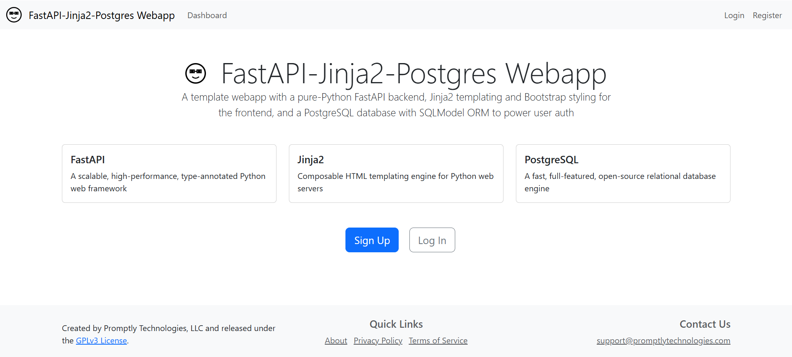

# README


## FastAPI, Jinja2, PostgreSQL Webapp



This project is still under development.

### Architecture

This application uses a Post-Redirect-Get (PRG) pattern. The user
submits a form, which sends a POST request to a FastAPI endpoint on the
server. The database is updated, and the user is redirected to a GET
endpoint, which fetches the updated data and re-renders the Jinja2 page
template with the new data.


The advantage of the PRG pattern is that it is very straightforward to
implement and keeps most of the rendering logic on the server side. The
disadvantage is that it requires an extra round trip to the database to
fetch the updated data, and re-rendering the entire page template may be
less efficient than a partial page update on the client side.

### Install development dependencies in a VSCode Dev Container

If you use VSCode with Docker to develop in a container, the following
VSCode Dev Container configuration will install all dependencies:

``` json
{
    "name": "Python 3",
    "image": "mcr.microsoft.com/devcontainers/python:1-3.12-bullseye",
    "postCreateCommand": "sudo apt update && sudo apt install -y python3-dev libpq-dev graphviz && pipx install poetry && poetry install && poetry shell",
    "features": {
        "ghcr.io/devcontainers/features/docker-outside-of-docker:1": {},
        "ghcr.io/rocker-org/devcontainer-features/quarto-cli:1": {}
    }
}
```

Simply create a `.devcontainer` folder in the root of the project and
add a `devcontainer.json` file in the folder with the above content.
VSCode may prompt you to install the Dev Container extension if you
haven’t already, and/or to open the project in a container. If not, you
can manually select “Dev Containers: Reopen in Container” from View \>
Command Palette.

### Install development dependencies manually

#### Python and Docker

- [Python 3.12 or higher](https://www.python.org/downloads/)
- [Docker and Docker Compose](https://docs.docker.com/get-docker/)

#### PostgreSQL headers

For Ubuntu/Debian:

``` bash
sudo apt update && sudo apt install -y python3-dev libpq-dev
```

For macOS:

``` bash
brew install postgresql
```

For Windows:

- No installation required

#### Quarto CLI and Graphviz

- [Quarto CLI](https://quarto.org/docs/get-started/)

For macOS:

``` bash
brew install graphviz
```

For Ubuntu/Debian:

``` bash
sudo apt update && sudo apt install -y graphviz
```

For Windows:

- Download and install from
  [Graphviz.org](https://graphviz.org/download/#windows)

#### Python dependencies

1.  Install Poetry

``` bash
pipx install poetry
```

2.  Install project dependencies

``` bash
poetry install
```

3.  Activate shell

``` bash
poetry shell
```

(Note: You will need to activate the shell every time you open a new
terminal session. Alternatively, you can use the `poetry run` prefix
before other commands to run them without activating the shell.)

### Set environment variables

Copy .env.example to .env with `cp .env.example .env`.

Generate a 256 bit secret key with `openssl rand -base64 32` and paste
it into the .env file.

Set your desired database name, username, and password in the .env file.

To use password recovery, register a [Resend](https://resend.com/)
account, verify a domain, get an API key, and paste the API key into the
.env file.

### Start development database

``` bash
docker compose up -d
```

### Run the development server

Make sure the development database is running and tables and default
permissions/roles are created first.

``` bash
uvicorn main:app --host 0.0.0.0 --port 8000 --reload
```

Navigate to http://localhost:8000/

### Lint types with mypy

``` bash
mypy .
```

### Render the README

When updating the documentation, remember to make changes in the
README.qmd file, not the README.md file. Then run the following command
to render the README.md file:

``` bash
quarto render README.qmd
```

### Contributing

Fork the repository, create a new branch, make your changes, and submit
a pull request.

### License

This project is licensed under the MIT License. See the LICENSE file for
more details.
