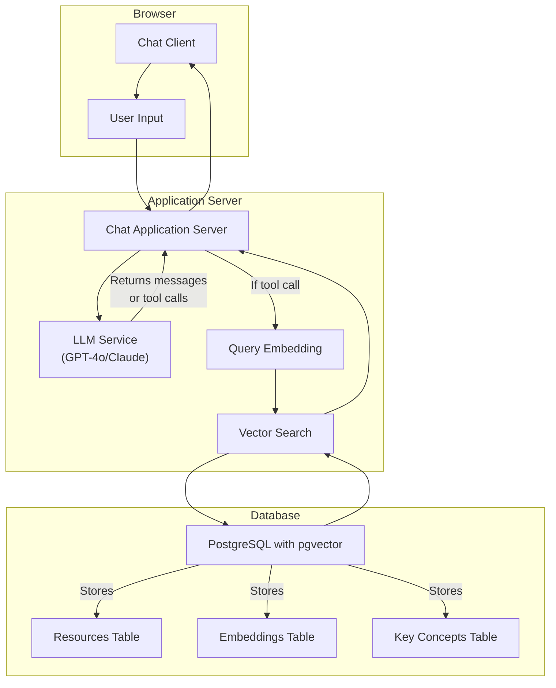

# Nature Finance RAG client for working with IMF climate development reports

This is the application layer for a web app for AI-powered semantic search over the International Monetary Fund's climate change development reports (CCDRs). It is built on the [FastAPI, Jinja2, PostgreSQL Webapp Template](https://github.com/Promptly-Technologies-LLC/fastapi-jinja2-postgres-webapp) and is meant to be used with the (Nature Finance RAG Database and API)[https://github.com/Teal-Insights/nature-finance-rag-api] as the data storage and retrieval layer.

## Getting Started

### Install `uv` for Dependency Management

MacOS and Linux:

``` bash
wget -qO- https://astral.sh/uv/install.sh | sh
```

Windows:

``` bash
powershell -ExecutionPolicy ByPass -c "irm https://astral.sh/uv/install.ps1 | iex"
```

See the [uv installation
docs](https://docs.astral.sh/uv/getting-started/installation/) for more
information.

### Install Python

Install the latest version of Python from either the official [downloads
page](https://www.python.org/downloads/) or using `uv`:

``` bash
# Installs the latest version
uv python install
```

### Install Docker Desktop and Docker Compose

Install Docker Desktop and Coker Compose for your operating system by
following the [instructions in the
documentation](https://docs.docker.com/compose/install/).

### Install PostgreSQL headers

For Ubuntu/Debian:

``` bash
sudo apt update && sudo apt install -y python3-dev libpq-dev libwebp-dev
```

For macOS:

``` bash
brew install postgresql
```

For Windows:

- No installation required

### Install Python Dependencies

From the root directory, run:

``` bash
uv venv
uv sync
```

This will create an in-project virtual environment and install all
dependencies.

### Set Environment Variables

Copy `.env.example` to `.env` with `cp .env.example .env`.

Generate a 256 bit secret key with `openssl rand -base64 32` and paste
it into the .env file.

Set your desired database name, username, and password in the .env file.

To use password recovery, register a [Resend](https://resend.com/)
account, verify a domain, get an API key, and paste the API key into the
.env file.

### Start development database

To start the development database, run the following command in your
terminal from the root directory:

``` bash
docker compose up -d
```

### Run the development server

Make sure the development database is running and tables and default
permissions/roles are created first.

``` bash
uv run python -m uvicorn main:app --host 0.0.0.0 --port 8000 --reload
```

Navigate to http://localhost:8000/

## Usage

To "chat with the CCDRs", register and/or sign in and navigate to the chat interface on the home page. Use the chat interface to ask the chatbot questions about the CCDRs.

## Architecture



## License

This project is created and maintained by Teal Insights and licensed under the MIT
License. See the LICENSE file for more details.
