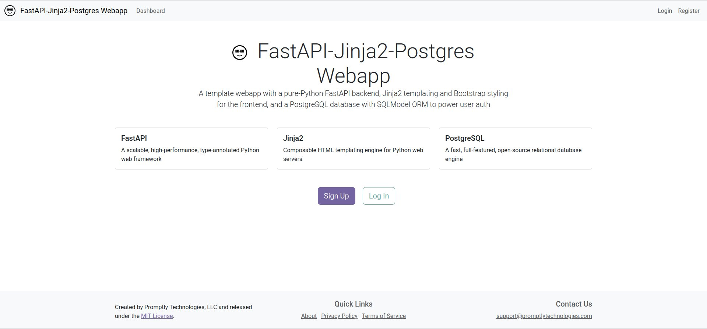

# FastAPI, Jinja2, PostgreSQL Webapp Template




## Quickstart

This quickstart guide provides a high-level overview. See the full
documentation for comprehensive information on
[features](https://promptlytechnologies.com/fastapi-jinja2-postgres-webapp/index.html),
[installation](https://promptlytechnologies.com/fastapi-jinja2-postgres-webapp/docs/installation.html),
[architecture](https://promptlytechnologies.com/fastapi-jinja2-postgres-webapp/docs/architecture.html),
[conventions, code style, and
customization](https://promptlytechnologies.com/fastapi-jinja2-postgres-webapp/docs/customization.html),
[deployment to cloud
platforms](https://promptlytechnologies.com/fastapi-jinja2-postgres-webapp/docs/deployment.html),
and
[contributing](https://promptlytechnologies.com/fastapi-jinja2-postgres-webapp/docs/contributing.html).

## Features

This template combines three of the most lightweight and performant
open-source web development frameworks into a customizable webapp
template with:

- Pure Python backend
- Minimal-Javascript frontend
- Powerful, easy-to-manage database

The template also includes full-featured secure auth with:

- Token-based authentication
- Password recovery flow
- Role-based access control system

## Design Philosophy

The design philosophy of the template is to prefer low-level,
best-in-class open-source frameworks that offer flexibility,
scalability, and performance without vendor-lock-in. You’ll find the
template amazingly easy not only to understand and customize, but also
to deploy to any major cloud hosting platform.

## Tech Stack

**Core frameworks:**

- [FastAPI](https://fastapi.tiangolo.com/): scalable, high-performance,
  type-annotated Python web backend framework
- [PostgreSQL](https://www.postgresql.org/): the world’s most advanced
  open-source database engine
- [Jinja2](https://jinja.palletsprojects.com/en/3.1.x/): frontend HTML
  templating engine
- [SQLModel](https://sqlmodel.tiangolo.com/): easy-to-use Python ORM

**Additional technologies:**

- [uv](https://docs.astral.sh/uv/): Python dependency manager
- [Pytest](https://docs.pytest.org/en/7.4.x/): testing framework
- [Docker](https://www.docker.com/): development containerization
- [Github Actions](https://docs.github.com/en/actions): CI/CD pipeline
- [Quarto](https://quarto.org/docs/): simple documentation website
  renderer
- [MyPy](https://mypy.readthedocs.io/en/stable/): static type checker
  for Python
- [Bootstrap](https://getbootstrap.com/): HTML/CSS styler
- [Resend](https://resend.com/): zero- or low-cost email service used
  for password recovery

## Installation

For comprehensive installation instructions, see the [installation
page](https://promptlytechnologies.com/fastapi-jinja2-postgres-webapp/docs/installation.html).

### uv

MacOS and Linux:

``` bash
wget -qO- https://astral.sh/uv/install.sh | sh
```

Windows:

``` bash
powershell -ExecutionPolicy ByPass -c "irm https://astral.sh/uv/install.ps1 | iex"
```

See the [uv installation
docs](https://docs.astral.sh/uv/getting-started/installation/) for more
information.

### Python

Install Python 3.12 or higher from either the official [downloads
page](https://www.python.org/downloads/) or using uv:

``` bash
# Installs the latest version
uv python install
```

### Docker and Docker Compose

Install Docker Desktop and Coker Compose for your operating system by
following the [instructions in the
documentation](https://docs.docker.com/compose/install/).

### PostgreSQL headers

For Ubuntu/Debian:

``` bash
sudo apt update && sudo apt install -y python3-dev libpq-dev libwebp-dev
```

For macOS:

``` bash
brew install postgresql
```

For Windows:

- No installation required

### Python dependencies

From the root directory, run:

``` bash
uv venv
uv sync
```

This will create an in-project virtual environment and install all
dependencies.

### Set environment variables

Copy `.env.example` to `.env` with `cp .env.example .env`.

Generate a 256 bit secret key with `openssl rand -base64 32` and paste
it into the .env file.

Set your desired database name, username, and password in the .env file.

To use password recovery and other email features, register a
[Resend](https://resend.com/) account, verify a domain, get an API key,
and paste the API key and the email address you want to send emails from
into the .env file. Note that you will need to [verify a domain through
the Resend
dashboard](https://resend.com/docs/dashboard/domains/introduction) to
send emails from that domain.

### Start development database

To start the development database, run the following command in your
terminal from the root directory:

``` bash
docker compose up -d
```

### Run the development server

Make sure the development database is running and tables and default
permissions/roles are created first.

``` bash
uv run python -m uvicorn main:app --host 0.0.0.0 --port 8000 --reload
```

Navigate to http://localhost:8000/

### Lint types with mypy

``` bash
uv run mypy .
```

## Developing with LLMs

In line with the [llms.txt standard](https://llmstxt.org/), we have
provided a Markdown-formatted prompt—designed to help LLM agents
understand how to work with this template—as a text file:
[llms.txt](docs/static/llms.txt).

One use case for this file, if using the Cursor IDE, is to rename it to
`.cursorrules` and place it in your project directory (see the [Cursor
docs](https://docs.cursor.com/context/rules-for-ai) on this for more
information). Alternatively, you could use it as a custom system prompt
in the web interface for ChatGPT, Claude, or the LLM of your choice.

We have also exposed the full Markdown-formatted project documentation
as a [single text file](docs/static/documentation.txt) for easy
downloading and embedding for RAG workflows.

## Contributing

Your contributions are welcome! See the [issues
page](https://github.com/promptly-technologies-llc/fastapi-jinja2-postgres-webapp/issues)
for ideas. Fork the repository, create a new branch, make your changes,
and submit a pull request.

## License

This project is created and maintained by [Promptly Technologies,
LLC](https://promptlytechnologies.com/) and licensed under the MIT
License. See the LICENSE file for more details.
